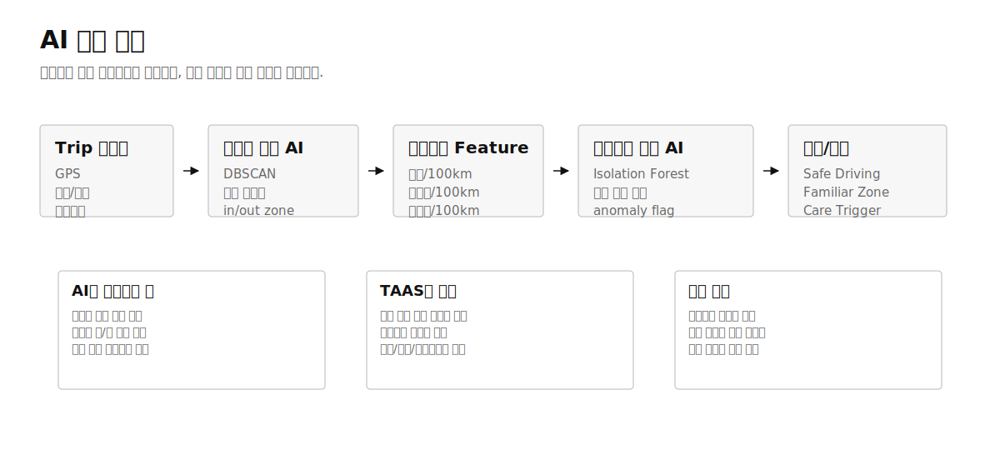
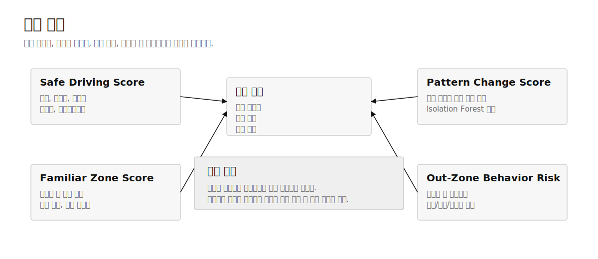
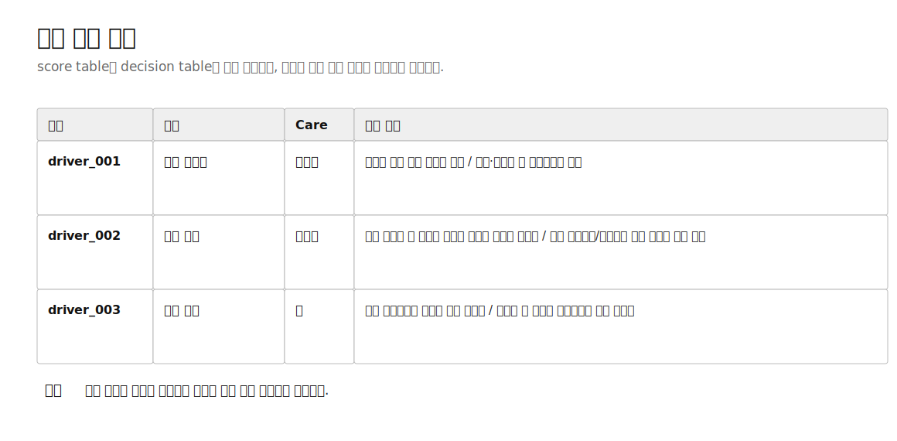

# 생활권 기반 시니어 안심주행 특약 AI 모델 견본

## 한 줄 요약

시니어 운전자의 익숙한 생활권과 평소 운전패턴을 기준으로 최근 변화가 커진 고객을 조기에 발견하고, 추가 리워드 또는 예방 케어 안내로 연결하는 자동차보험 특약 견본입니다.

차별점은 “얼마나 적게 탔는가”가 아니라 “익숙한 생활권에서 평소처럼 안정적으로 운전했는가, 그리고 최근에 위험한 변화가 생겼는가”를 AI가 분리한다는 점입니다.

## 심사 관점의 핵심 판단

| 판단 항목 | 기존 안전운전 특약의 한계 | 제안 구조의 보완점 | 현재 제출 패키지의 근거 |
|---|---|---|---|
| 고객 이해 | 주행거리와 단일 안전점수 중심이라 시니어의 익숙한 생활권 운전을 충분히 반영하기 어렵다 | 반복 목적지, 반복 경로, 생활권 안팎 주행 비율을 고객별로 계산한다 | [데이터 입력 필드 계약서](../data-contract.md), `zone_feature_table.csv` |
| AI 실현 가능성 | 사고 라벨이 없으면 개인별 사고 예측 모델을 만들기 어렵다 | 사고 예측이 아니라 평소패턴 변화 감지로 문제를 재정의한다 | `pattern_change_score.csv`, `src/models/pattern_model.py` |
| 상품 연결성 | 위험 고객을 벌점처럼 분리하면 시니어 친화성이 낮다 | 위험 신호를 보험료 인상이 아니라 예방 케어 안내로 연결한다 | `decision_table.csv`, [모델 견본 결과 요약](../../reports/model_demo_summary.md) |
| 데이터 수급 | 실제 고객 앱 데이터 확보 전에는 검증이 지연된다 | 공공 사업용차량 CSV로 feature pipeline 연결성을 먼저 검증한다 | `scripts/validate_trip_csv_mapping.py` |

## AI 활용 포인트

| AI 처리 | 모델 역할 | 심사위원 질문에 대한 답 |
|---|---|---|
| DBSCAN 생활권 생성 | baseline 기간의 출발·도착 좌표를 밀도 기반으로 묶어 고객별 반복 생활권 중심을 만들고 P90 버퍼로 자연스러운 주변 이동을 허용한다 | 고객의 익숙한 병원, 시장, 가족 방문지와 주차·주변 시설 방문을 마일리지와 별도 feature로 전환했다 |
| 평소패턴 이상탐지 | 최근 trip vector가 고객 자신의 baseline보다 얼마나 달라졌는지 계산하고 `pattern_change_score`와 `anomaly_flag`를 남긴다 | 개인 사고 라벨 없이도 “평소와 달라진 운전”을 찾는 구현 가능한 AI 문제로 재정의했다 |
| 설명 리포트 생성 | score, care trigger, reason code, top change signal을 함께 남겨 직원용 리포트와 고객 안내 문구로 연결한다 | AI 결과가 블랙박스 점수에 머물지 않고 왜 추가 리워드 또는 예방 케어인지 설명된다 |

## 지금 중요한 이유

고령 운전자는 단순히 “나이가 높다”는 이유로 하나의 위험군으로 묶기 어렵습니다. 같은 연령대라도 주로 익숙한 병원, 시장, 가족 방문지, 근린 생활권을 반복 운전하는 고객과 최근 야간 장거리, 낯선 목적지, 급감속이 함께 늘어난 고객은 서로 다른 안내가 필요합니다. 기존 특약이 주행거리 또는 일반 안전운전 점수에 머물면 이 차이를 상품 언어로 정리하기 어렵습니다.

제안의 출발점은 사고를 맞히는 모델이 아닙니다. 제출 견본은 고객별 “평소와 달라진 정도”를 찾고, 그 변화가 생활권 밖 주행과 위험운전 행동 증가를 동반하는지 점검합니다. 사고 라벨이 없는 상태에서도 구현 가능한 범위이며, 공공 사업용차량 데이터 필드와도 연결됩니다. 실제 서비스 단계에서는 고객 동의 기반 앱, 내비게이션, 커넥티드카 데이터를 사용하고, 공모전 단계에서는 공개 CSV로 구조와 재현성을 검증합니다.

## 문제 정의

심사위원이 확인해야 할 문제는 세 가지입니다.

| 문제 | 현장에서 발생하는 어려움 | 제출 패키지의 해결 방향 |
|---|---|---|
| 생활권 맥락 부족 | 고령 운전자의 안정적 반복 운전을 “짧게 탔다” 또는 “점수가 높다”로만 평가한다 | 반복 출발지, 반복 목적지, 반복 경로를 생활권 feature로 전환한다 |
| 사고 라벨 의존 | 개인 단위 사고 라벨 없이 고성능 예측 모델을 주장하면 실현 가능성이 약해진다 | baseline-distance 이상탐지로 시작하고, 파일럿 단계에서 Isolation Forest로 교체 가능한 score 계약을 둔다 |
| 고객 커뮤니케이션 리스크 | 위험 신호가 곧바로 불이익처럼 전달되면 특약 수용성이 낮아진다 | 판단 결과를 추가 리워드, 기본 유지, 예방 케어로 제한한다 |

이 구조는 생활권 밖 주행 자체를 자동 위험으로 보지 않습니다. 생활권 밖 주행은 병원, 가족 돌봄, 장보기처럼 정상적인 이유가 있을 수 있습니다. 제안 모델은 생활권 밖 주행과 위험운전 행동, 야간 비율, 평소 대비 변화가 동시에 커지는 경우에만 예방 케어 후보로 분리합니다.

## 제안 구조



_그림 1. Trip CSV에서 생활권 feature, 평소패턴 변화 감지, score table, decision table로 이어지는 제출용 파이프라인입니다._

| 단계 | 입력 | 처리 | 산출물 |
|---|---|---|---|
| Trip 입력 | driver_id, trip_id, 시각, 좌표, 거리, 위험운전 이벤트 | 필수 컬럼 검증, 타입 변환, 결측·음수 값 확인 | `data/raw/trip_sample.csv` |
| 생활권 생성 | 출발/도착 좌표, baseline 기간 trip | DBSCAN으로 반복 생활권 중심을 만들고 `max(500m, min(P90, 2km))` 버퍼로 core/buffer/outer 분리 | `zone_feature_table.csv` |
| 운전행동 feature | 과속, 급가속, 급감속, 급회전, 야간 주행 | 100km당 이벤트 수와 최근 기간 비율 계산 | `driving_feature_table.csv` |
| 평소패턴 변화 감지 | baseline trip vector, recent trip vector | baseline 대비 양의 변화 신호를 이상탐지 점수와 주요 변화 feature로 기록 | `pattern_change_score.csv` |
| 점수 계산 | 생활권 안정성, 위험행동, 변화 점수 | Safe Driving, Familiar Zone, Pattern Change, Out-Zone Risk 계산 | `score_table.csv` |
| 상품 판단 | score table | 추가 리워드, 기본 유지, 예방 케어 중 하나로 분류 | `decision_table.csv` |

## 데이터 계약과 실제 CSV 수신 대응

팀원이 공공데이터포털에서 받은 실제 CSV는 곧바로 모델에 넣지 않습니다. 먼저 `docs/data-contract.md`에 정의된 표준 Trip schema와 원본 헤더를 대조합니다. 검증 명령은 아래와 같습니다.

```bash
python3 scripts/validate_trip_csv_mapping.py data/raw/<원본파일명>.csv --run-pipeline --generate-visuals
```

| 검증 항목 | 통과 기준 | 실패 시 기록 |
|---|---|---|
| 원본 헤더 | 표준 컬럼과 직접 매핑되거나 생성 규칙이 존재한다 | 누락된 표준 컬럼 이름 |
| 식별자 | 차량번호나 회사코드를 원문 노출 없이 `driver_###`로 익명화한다 | driver_id 생성 불가 사유 |
| 운행시간과 평균속도 | 원본 컬럼 또는 시작/종료 시각 기반 계산이 가능하다 | 계산에 필요한 시각·거리 컬럼 누락 |
| 급회전 | 급좌회전건수와 급우회전건수를 합산할 수 있다 | 좌·우회전 중 누락된 컬럼 |
| 파이프라인 연결 | feature, score, decision, figure가 재생성된다 | 실행 불가 사유와 보완해야 할 컬럼 |

현재 제출 패키지는 `trip_sample.csv`로 end-to-end 재현성을 확보한 상태입니다. 실제 공공 CSV가 도착하면 같은 스크립트가 매핑 리포트를 만들고, 통과 시 표준화된 중간 CSV를 생성한 뒤 결과 표와 SVG figure를 다시 생성합니다. 실제 CSV가 사업용 차량 데이터라는 한계는 유지하며, 시니어 개인 승용차 대표 데이터라고 과장하지 않습니다.

## 모델 판단 구조



_그림 2. 점수는 고객을 벌점화하기 위한 수치가 아니라 리워드와 예방 케어 판단을 분리하기 위한 내부 근거입니다._

| 점수 | 의미 | 높을 때의 해석 | 상품 판단에서의 역할 |
|---|---|---|---|
| Safe Driving Score | 과속, 급가속, 급감속, 급회전, 야간 주행이 낮은지 | 위험운전 이벤트가 적다 | 추가 리워드 후보 확인 |
| Familiar Zone Score | 생활권 중심 주행과 반복 경로가 안정적인지 | 익숙한 생활권 운전이 많다 | 시니어 친화적 안정 운전 근거 |
| Pattern Change Score | 최근 운전이 평소와 얼마나 달라졌는지 | 평소 대비 변화가 크다 | 예방 케어 후보 탐지 |
| Out-Zone Behavior Risk | 생활권 밖 주행과 위험행동이 함께 늘었는지 | 낯선 주행과 위험행동이 결합된다 | 단순 외출과 케어 신호 구분 |

판단 규칙은 투명하게 유지합니다. Safe Driving이 높고 Familiar Zone이 높으며 Pattern Change가 낮으면 추가 리워드 후보가 됩니다. Pattern Change와 Out-Zone Behavior Risk가 함께 높으면 예방 케어 후보가 됩니다. 나머지는 기본 유지로 두고, 추가 데이터 확보 후 재평가합니다. 이 구조는 보험료를 자동 산정하지 않으며, LLM이 의사결정을 직접 수행하지도 않습니다.

## 구현 근거

| 산출물 | 위치 | 검토자가 확인할 내용 |
|---|---|---|
| 데이터 계약 | `docs/data-contract.md` | 실제 CSV 수신 후 어떤 컬럼을 맞춰야 하는지 |
| 모델 파이프라인 | `src/run_pipeline.py` | 입력 CSV에서 feature, score, decision table까지 재생성되는지 |
| 매핑 검증 | `scripts/validate_trip_csv_mapping.py` | 원본 공공 CSV 헤더가 모델 표준 컬럼으로 연결되는지 |
| 결과 요약 | `reports/model_demo_summary.md` | 고객별 판단 예시와 해석이 일관적인지 |
| 시각 자료 | `reports/figures/*.svg` | 파이프라인, 점수 구조, 판단 흐름이 source와 맞는지 |

실행 기준은 명확합니다.

```bash
python3 scripts/generate_sample_trip_data.py
python3 -m src.run_pipeline
python3 scripts/generate_analysis_outputs.py
python3 scripts/review_submission_source.py docs/submissions/proposal.md
```

PDF는 마지막 포장 단계입니다. 품질 판단은 Markdown source, CSV, Python script, SVG figure, source review 결과에서 먼저 이뤄집니다.

## 고객별 판단 예시



_그림 3. 같은 시니어 고객군 안에서도 안정적 반복 운전, 기본 유지, 예방 케어 후보가 분리됩니다._

| 고객 | 결과 | 판단 근거 | 고객 안내 방향 |
|---|---|---|---|
| driver_001 | 추가 리워드 | 생활권 중심 주행과 낮은 위험행동, 낮은 패턴 변화 | 안정 운전 유지 혜택 안내 |
| driver_002 | 기본 유지 | 일부 생활권 밖 주행이 있으나 고위험 변화는 제한적 | 기존 혜택 유지와 추가 데이터 관찰 |
| driver_003 | 예방 케어 | 생활권 밖 주행, 위험행동, 평소패턴 변화가 동시에 증가 | 차량 점검, 안전운전 리포트, 가족 공유형 안내 검토 |

핵심은 “위험한 사람을 골라낸다”가 아닙니다. 최근 변화가 커진 고객에게 불이익 대신 예방적 안내를 연결하고, 안정적인 생활권 운전 고객에게는 리워드 근거를 분명히 제공하는 것입니다.

## 사업화 경로

| 단계 | 도입 형태 | 데이터 | 보험사 관점의 가치 |
|---|---|---|---|
| 공모전 견본 | 샘플 CSV와 공공 사업용차량 CSV로 모델 구조 검증 | 공개 CSV, 합성 샘플 | 사고 라벨 없이도 구현 가능한 차별점 확인 |
| 파일럿 | 고객 동의 기반 앱 또는 내비게이션 trip 로그 연동 | 익명화 trip, 이벤트 요약 | 시니어 특약 후보군과 예방 케어 메시지 A/B 테스트 |
| 상품 적용 | 리워드 특약과 안전 리포트 결합 | 운영 데이터, 고객 피드백 | 유지율 개선, 사고 예방 커뮤니케이션, 가족 안심 가치 |

첫 도입은 보험료 산정 모델이 아니라 리포트형 부가 혜택으로 설정하는 편이 현실적입니다. 리워드와 예방 케어 안내를 먼저 분리하면 규제·윤리 리스크를 낮추면서 고객 수용성을 확인할 수 있습니다.

## 기대 효과

심사위원 관점에서는 기존 안전운전 점수와 다른 차별점이 분명합니다. 제안은 “얼마나 적게 탔는가”보다 “익숙한 생활권에서 평소처럼 안정적으로 운전하는가”를 본다는 점에서 시니어 고객의 실제 생활 패턴에 가깝습니다.

보험사 상품 담당자 관점에서는 실행 가능한 데이터 흐름이 장점입니다. 표준 Trip schema, 원본 CSV 매핑 검증, feature table, score table, decision table이 분리되어 있어 실제 데이터가 들어와도 어느 단계에서 막히는지 바로 확인할 수 있습니다.

고객 관점에서는 불이익 중심 메시지를 피할 수 있습니다. 안정 운전 고객에게는 추가 리워드를, 변화가 큰 고객에게는 차량 점검이나 안전 리포트 같은 예방 케어를 안내합니다. 생활권 밖 주행을 자동 위험으로 단정하지 않기 때문에 병원, 가족 방문, 장보기 같은 정상적인 생활 이동을 존중할 수 있습니다.

## 한계와 다음 검증

| 구분 | 현재 한계 | 다음 검증 |
|---|---|---|
| 데이터 대표성 | 공공 사업용차량 CSV는 시니어 개인 승용차를 대표하지 않는다 | 실제 고객 동의 기반 trip 데이터로 feature 분포 재점검 |
| 모델 성능 | 사고 라벨 예측 모델이 아니라 평소패턴 변화 감지 견본이다 | 이상 변화 점수와 상담·점검 반응의 상관성 검토 |
| 상품 적용 | 보험료 산정이나 인수 심사 자동화가 아니다 | 리워드, 리포트, 예방 안내의 운영 KPI 설계 |
| 개인정보 | 원본 좌표와 차량 식별자 보호가 필수다 | 좌표 grid화, 익명 ID, 보존 기간 정책 확정 |

제출 단계의 결론은 명확합니다. 이 제안은 실제 보험료 산정을 주장하지 않습니다. 대신 생활권 생성 AI, 평소패턴 변화 감지 AI, 위험행동 점수화, 예방 케어 판단을 하나의 재현 가능한 source-first 패키지로 묶어 심사위원이 구현 가능성과 상품 차별성을 동시에 검토할 수 있게 합니다.
